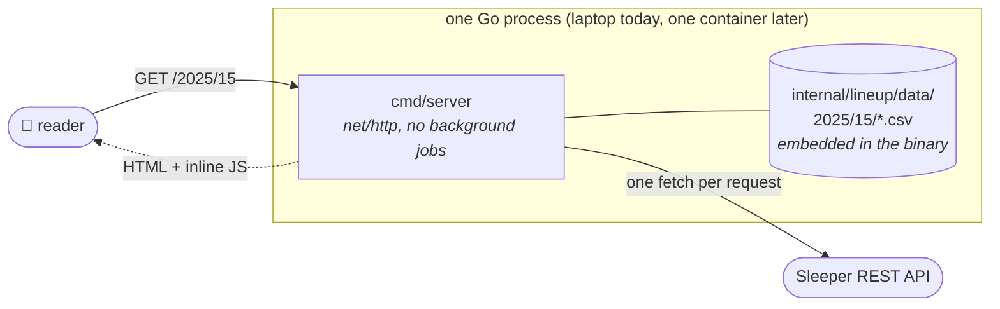
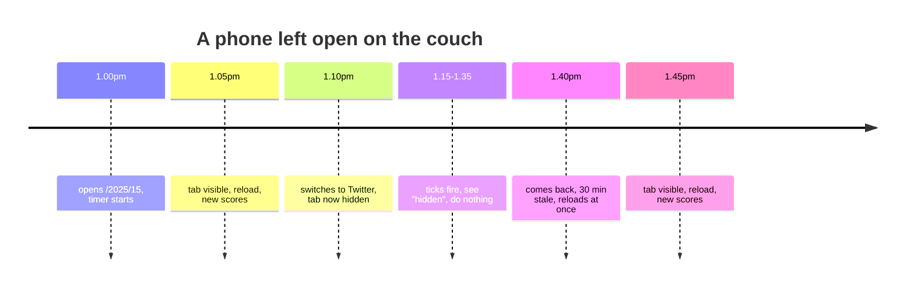
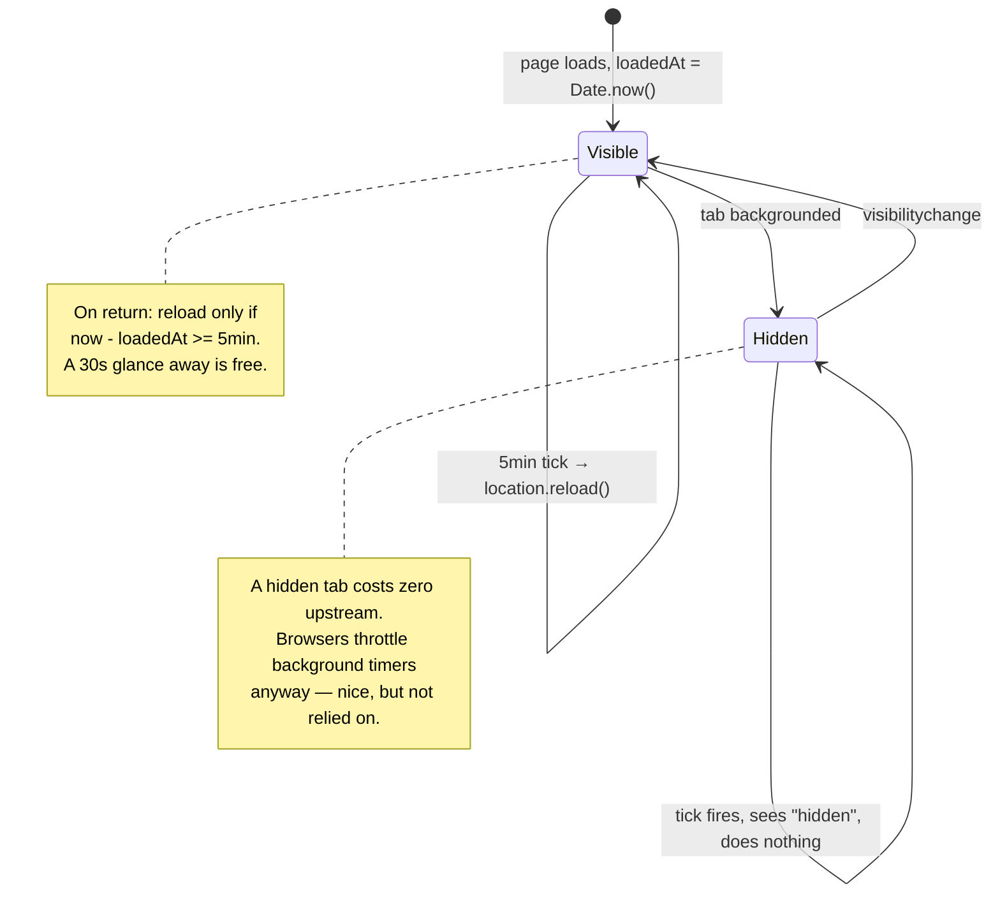
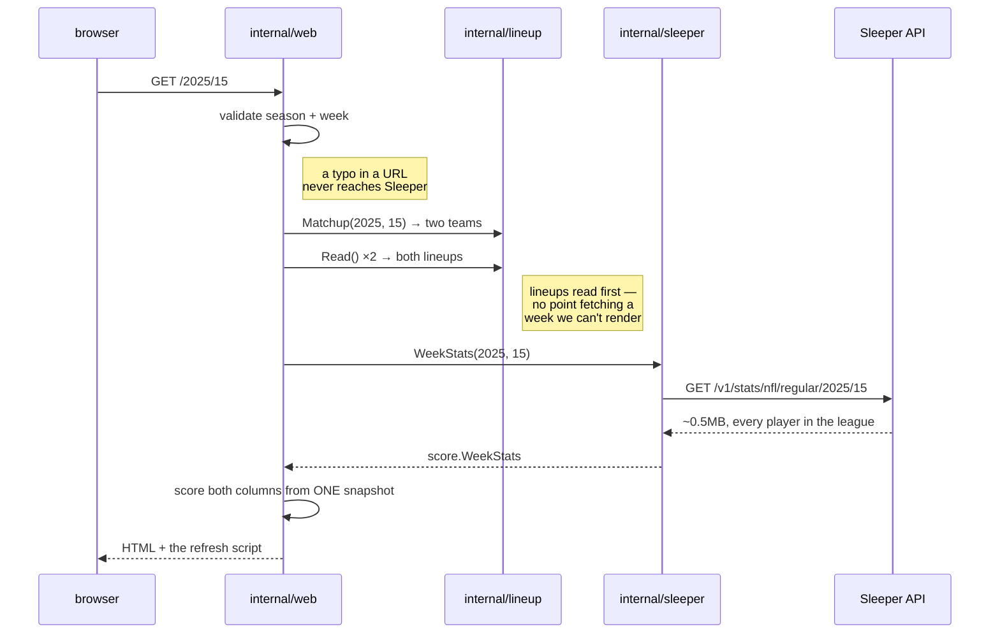
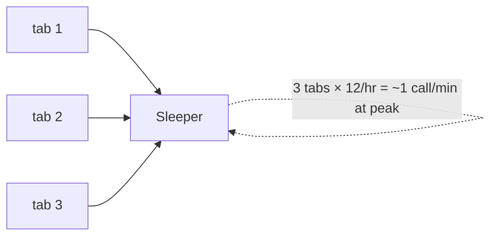
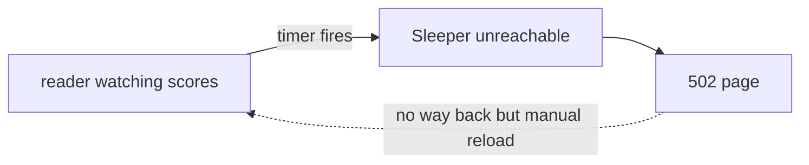

# Architecture

How the running system behaves, from the reader's side and from the traffic's side.
Package-level structure lives in [package-dependencies.md](package-dependencies.md); this is the
altitude above that.

## The whole thing, one picture

Two things worth internalising:

- **The server is boring.** Request in, response out. No cron, no scheduler, no per-viewer state,
  no sockets held open. Between requests it's asleep in an accept loop.
- **The clock lives in the browser.** The page that goes out carries ~15 lines of vanilla JS that
  reload it on a timer. That's the entire "live" mechanism.

## 1. What the reader gets

`GET /{season}/{week}` → two columns, nine starters each, a total per side. No margin, no leader
highlight, no win probability — [ADR 0004](adr/0004-web-frontend-stack.md) #8, and the refresh
script is bound by it too (it never touches the previous page's values).

The reader opens it Sunday at 1pm and puts the phone down. What happens next:

The point isn't saving a click. **A stale page and a current page look identical** — nobody hits
refresh on a page they don't suspect. Left alone, the page keeps itself honest.

Known gap: if the timer breaks or bfcache leaves a tab weird, it's silently stale and still looks
identical. The as-of timestamp is the answer and it isn't built yet.

## 2. The refresh loop

Per **page load** — a new tab is a new document with its own independent clock, and a reload throws
the old one away and starts fresh at zero. Nothing is persisted; no cookie, no localStorage.

Deliberately **not** fetch-and-swap: `location.reload()` re-runs the server path we already trust,
and the document is two short lists. The cost of that choice is section 4.

## 3. Where the traffic goes

One page load = one Sleeper call. Every time.

Two invariants in there: the lineup tree is consulted before the network, and both columns are
scored from a single fetch so the two sides can never come from different snapshots of the week.

### The math

**There is no cache.** Not browser-side, not server-side. New tab → Sleeper. Reopen the app →
Sleeper. Timer fires → Sleeper. Load scales with open visible tabs, which is why the visibility
guard matters: it bounds cost by who's actually *looking*, not by how many tabs exist.

At three viewers this is fine. Before this is public, the TTL + single-flight cache goes in — and
that one is server-side and shared, keyed by `(season, week)`, so it's the same entry for every tab
on every device, and clearing your browser cache does nothing to it.

## 4. The sharp edge

Sleeper is down → the handler refuses to serve a zeroed page (correct: "we don't know" ≠ "they
scored nothing") → **502 replaces the scores the reader was looking at.**

This is the real cost of reload-over-swap. Not mitigated today. The TTL cache makes it much rarer
by absorbing brief blips; fetch-and-swap would kill it entirely at a complexity cost we said no to.
Worth revisiting after one live Sunday.

Also live: Sleeper revises stats, so a total can go *down* across a refresh with nothing on the page
explaining why. Pre-existing, but refreshing turns it into something the reader watches happen.

## 5. The other endpoint

`POST /scores` — season, week, player IDs → stat lines and totals as JSON. Same `internal/score`
scoring, same `internal/sleeper` fetch, no HTML. It's what `scripts/scores.sh` and friends use
while the shell scripts are still the interim UI. Unaffected by any of the above.
