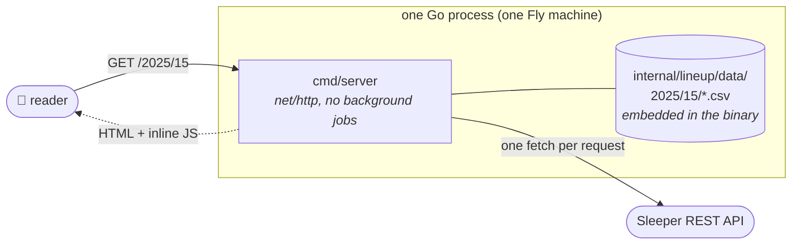
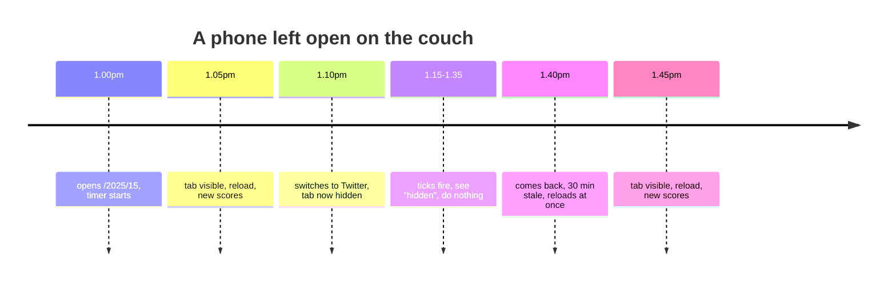
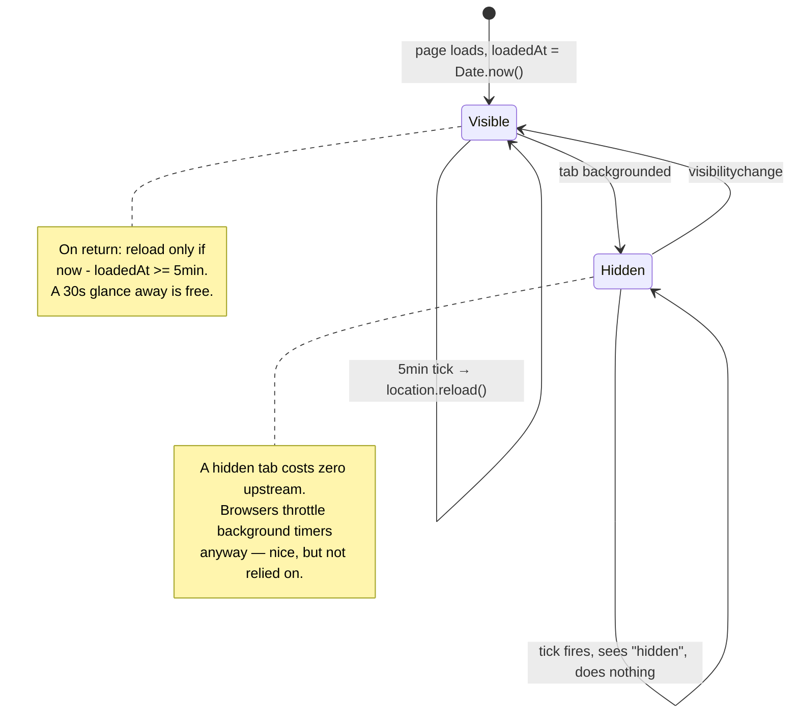
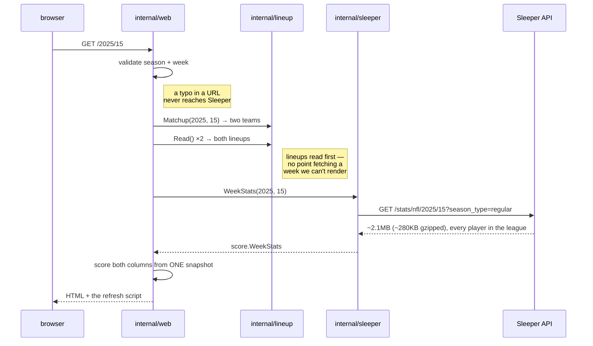
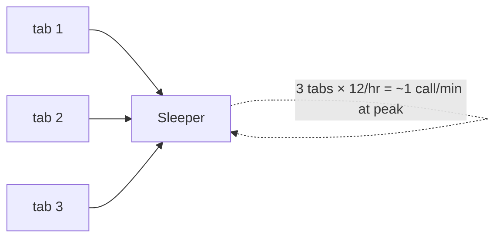
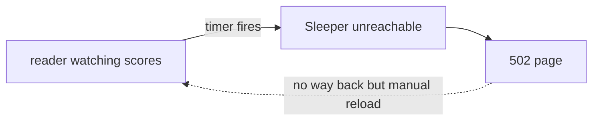
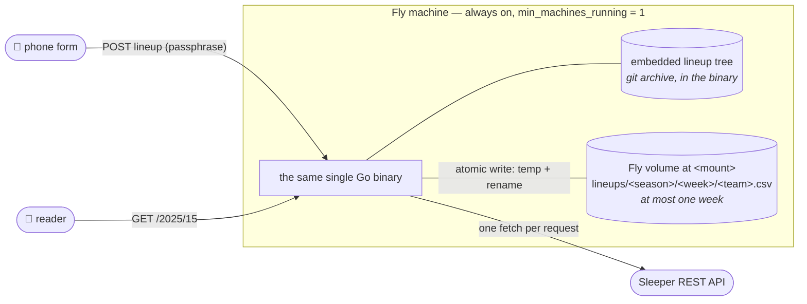
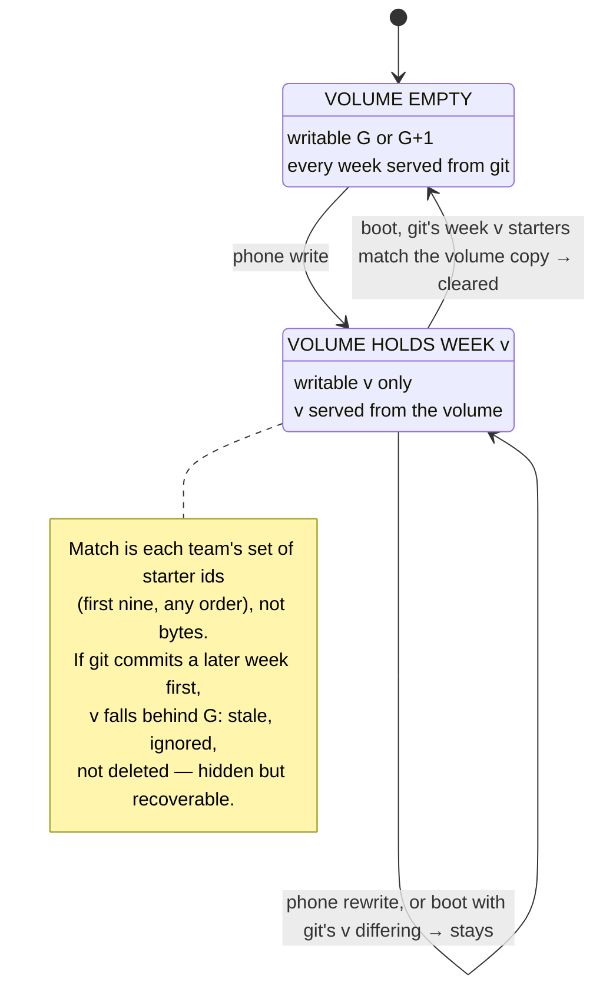

# Architecture

How the running system behaves, from the reader's side and from the traffic's side.
Package-level structure lives in [package-dependencies.md](package-dependencies.md); this is the
altitude above that. Sections 1–4 are the system as built; section 5 is phone-writable lineups on a
Fly volume, whose read side is built and whose write side and deployment are planned.

## The whole thing, one picture

```mermaid
graph LR
    reader(["📱 reader"]) -->|"GET /2025/15"| server
    subgraph box["one Go process (one Fly machine)"]
        server["cmd/server<br/><i>net/http, no background jobs</i>"]
        tree[("internal/lineup/data/<br/>2025/15/*.csv<br/><i>embedded in the binary</i>")]
        server --- tree
    end
    server -->|"one fetch per request"| sleeper(["Sleeper REST API"])
    server -.->|"HTML + inline JS"| reader
```

Two things worth internalising:

- **The server is boring.** Request in, response out. No cron, no scheduler, no per-viewer state,
  no sockets held open. Between requests it's asleep in an accept loop.
- **The clock lives in the browser.** The page that goes out carries ~15 lines of vanilla JS that
  reload it on a timer. That's the entire "live" mechanism.

## 1. What the reader gets

`GET /{season}/{week}` → two columns, nine starters each, a total per side. No margin, no leader
highlight, no win probability — [ADR 0004](adr/0004-web-frontend-stack.md) #8, and the refresh
script is bound by it too (it never touches the previous page's values).

The reader opens it Sunday at 1pm and puts the phone down. What happens next:

```mermaid
timeline
    title A phone left open on the couch
    1.00pm : opens /2025/15, timer starts
    1.05pm : tab visible, reload, new scores
    1.10pm : switches to Twitter, tab now hidden
    1.15-1.35 : ticks fire, see "hidden", do nothing
    1.40pm : comes back, 30 min stale, reloads at once
    1.45pm : tab visible, reload, new scores
```

The point isn't saving a click. **A stale page and a current page look identical** — nobody hits
refresh on a page they don't suspect. Left alone, the page keeps itself honest.

Known gap: if the timer breaks or bfcache leaves a tab weird, it's silently stale and still looks
identical. The as-of timestamp is the answer and it isn't built yet.

## 2. The refresh loop

Per **page load** — a new tab is a new document with its own independent clock, and a reload throws
the old one away and starts fresh at zero. Nothing is persisted; no cookie, no localStorage.

```mermaid
stateDiagram-v2
    [*] --> Visible: page loads, loadedAt = Date.now()
    Visible --> Visible: 5min tick → location.reload()
    Visible --> Hidden: tab backgrounded
    Hidden --> Hidden: tick fires, sees "hidden", does nothing
    Hidden --> Visible: visibilitychange
    note right of Hidden
        A hidden tab costs zero upstream.
        Browsers throttle background timers
        anyway — nice, but not relied on.
    end note
    note right of Visible
        On return: reload only if
        now - loadedAt >= 5min.
        A 30s glance away is free.
    end note
```

Deliberately **not** fetch-and-swap: `location.reload()` re-runs the server path we already trust,
and the document is two short lists. The cost of that choice is section 4.

## 3. Where the traffic goes

One page load = one Sleeper call. Every time.

```mermaid
sequenceDiagram
    participant B as browser
    participant W as internal/web
    participant R as internal/lineup
    participant S as internal/sleeper
    participant X as Sleeper API

    B->>W: GET /2025/15
    W->>W: validate season + week
    Note right of W: a typo in a URL<br/>never reaches Sleeper
    W->>R: Matchup(2025, 15) → two teams
    W->>R: Read() ×2 → both lineups
    Note right of R: lineups read first —<br/>no point fetching a<br/>week we can't render
    W->>S: WeekStats(2025, 15)
    S->>X: GET /stats/nfl/2025/15?season_type=regular
    X-->>S: ~2.1MB (~280KB gzipped), every player in the league
    S-->>W: score.WeekStats
    W->>W: score both columns from ONE snapshot
    W-->>B: HTML + the refresh script
```

Two invariants in there: the lineup tree is consulted before the network, and both columns are
scored from a single fetch so the two sides can never come from different snapshots of the week.

### The math

```mermaid
graph LR
    t1["tab 1"] --> S["Sleeper"]
    t2["tab 2"] --> S
    t3["tab 3"] --> S
    S -.->|"3 tabs × 12/hr = ~1 call/min at peak"| S
```

**There is no cache.** Not browser-side, not server-side. New tab → Sleeper. Reopen the app →
Sleeper. Timer fires → Sleeper. Load scales with open visible tabs, which is why the visibility
guard matters: it bounds cost by who's actually *looking*, not by how many tabs exist.

At three viewers this is fine. Before this is public, the TTL + single-flight cache goes in — and
that one is server-side and shared, keyed by `(season, week)`, so it's the same entry for every tab
on every device, and clearing your browser cache does nothing to it.

## 4. The sharp edge

Sleeper is down → the handler refuses to serve a zeroed page (correct: "we don't know" ≠ "they
scored nothing") → **502 replaces the scores the reader was looking at.**

```mermaid
graph LR
    A["reader watching scores"] -->|"timer fires"| B["Sleeper unreachable"]
    B --> C["502 page"]
    C -.->|"no way back but manual reload"| A
```

This is the real cost of reload-over-swap. Not mitigated today. The TTL cache makes it much rarer
by absorbing brief blips; fetch-and-swap would kill it entirely at a complexity cost we said no to.
Worth revisiting after one live Sunday.

Also live: Sleeper revises stats, so a total can go *down* across a refresh with nothing on the page
explaining why. Pre-existing, but refreshing turns it into something the reader watches happen.

## 5. Writable lineups (read side built)

This section is the design decided in
[ADR 0005](adr/0005-writable-lineups-on-a-volume.md) — set a lineup from a phone without a laptop,
git, or a deploy.

| Part | State |
|---|---|
| Two-layer read: embedded tree + volume (`internal/lineup/layered.go`) | **built** |
| Stale volume weeks ignored and logged, never deleted | **built** |
| Phone form, passphrase, atomic write | planned |
| Boot-time clear once git's week matches the volume | planned |
| Fly volume mount, `LINEUP_VOLUME` set, `min_machines_running = 1` | planned — `fly.toml` has no mount and runs `min_machines_running = 0` |

### Deployment

```mermaid
graph LR
    phone(["📱 phone form"]) -->|"POST lineup (passphrase)"| server
    reader(["📱 reader"]) -->|"GET /2025/15"| server
    subgraph fly["Fly machine — always on, min_machines_running = 1"]
        server["the same single Go binary"]
        tree[("embedded lineup tree<br/><i>git archive, in the binary</i>")]
        vol[("Fly volume at &lt;mount&gt;<br/>lineups/&lt;season&gt;/&lt;week&gt;/&lt;team&gt;.csv<br/><i>at most one week</i>")]
        server --- tree
        server ---|"atomic write: temp + rename"| vol
    end
    server -->|"one fetch per request"| sleeper(["Sleeper REST API"])
```

The read is two layers, and is built. `LINEUP_VOLUME` names the mount; the server reads only
`<mount>/lineups/`, so nothing else on the mount (`lost+found`) reads as a season. Unset, the
embedded tree is the only tree. The volume's week wins **only if it is at or after** the embedded
tree's latest week (a new week, or a phone edit of the latest archived one); every other week comes
from the embedded tree. A volume week older than that is stale: **ignored and logged, never
deleted** — it may hold edits that never reached git. If the volume holds more than one eligible
week, only the latest is served and the rest are logged as superseded. The volume is re-scanned per
read, so a week written while the server runs is served without a restart. An empty or missing
volume reads exactly like the embedded tree alone. Sleeper is untouched: still one fetch per
request.

`PLAYS_COLD_WAIT` sits beside `LINEUP_VOLUME` in the environment. It bounds how long the first read
of a week with no plays held waits for that week's whole-week play-by-play fetch, so turnover forced
fumbles show on first load. Unset means `30s`, the local value; `fly.toml` sets `0`, so the deployed
app never waits. A malformed or negative value stops the server at startup.

### What the volume holds (planned)

`G` = the embedded tree's latest week. The app, not a human, keeps the volume to the one in-flight
week. Nothing writes or clears the volume yet: the transitions below need the write path and the
boot-time clear.

```mermaid
stateDiagram-v2
    [*] --> Empty
    Empty: VOLUME EMPTY
    Empty: writable G or G+1
    Empty: every week served from git
    Holds: VOLUME HOLDS WEEK v
    Holds: writable v only
    Holds: v served from the volume
    Empty --> Holds: phone write
    Holds --> Holds: phone rewrite, or boot with git's v differing → stays
    Holds --> Empty: boot, git's week v starters match the volume copy → cleared
    note right of Holds
        Match is each team's set of starter ids
        (first nine, any order), not bytes.
        If git commits a later week first,
        v falls behind G: stale, ignored,
        not deleted — hidden but recoverable.
    end note
```

Archiving a week is committing the volume's version to git and deploying; the next boot sees the
match and clears it. Clearing happens only at boot, so a phone edit that reverts to git's copy
leaves the volume holding a duplicate until the next restart or deploy. That's harmless: it scores
the same starters git would. Clearing on presence alone would erase a phone edit of an archived week
on every deploy, which is why the starters must match. Starter order and bench rows are left out of
the match: neither is scored, so losing them to git's version on a clear costs nothing.
