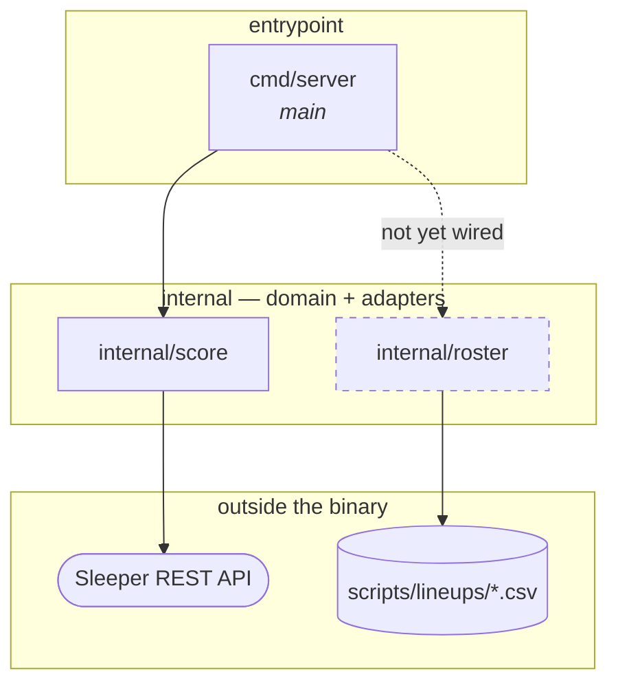

# Package Dependency Map

A one-page picture of how the Go packages relate, so a design question ("where does this belong?",
"what would that import cost me?") can be answered by looking rather than by reading code.

Scope: first-party packages only. Standard-library imports are listed per package below because
they say a lot about what a package *is* — `net/http` marks a boundary, no imports at all marks a
pure domain package.

## The map



Two first-party packages, one entrypoint, and **no edge between the two packages**. That is the
whole graph today — the shape is deliberate, not accidental, and the notes below say what keeps it
that way.

## The packages

| Package | Role | Imports (first-party) | Imports (stdlib) | Imported by |
| --- | --- | --- | --- | --- |
| `cmd/server` | Process entrypoint. Registers routes, owns the listen address. | `internal/score` | `log`, `net/http` | — |
| `internal/score` | Scoring rules + the Sleeper adapter + the HTTP handlers over both. | none | `context`, `encoding/json`, `fmt`, `log`, `net/http`, `time` | `cmd/server` |
| `internal/roster` | Roster/lineup knowledge: file format, tree layout, starters/bench split. | none | `bufio`, `fmt`, `io`, `os`, `path/filepath`, `strings` | *nothing yet* |

### `cmd/server`

Thin by design: it does nothing but bind method-qualified routes to handlers `internal/score`
already returns. If logic starts appearing here, it belongs in a package instead — this file should
stay readable as a table of contents for the service.

### `internal/score`

The only package that talks to the network. It currently holds four distinct jobs in one package:

- **`calc.go` — the rules.** `Points(StatLine) float64`. Pure, no imports at all. This is the piece
  most worth protecting from the rest.
- **`stats.go` — the vocabulary.** `StatLine`, provider-neutral. Deliberately carries no points
  field, so a stat line can never hold a stale total.
- **`sleeper.go` — the adapter.** Sleeper's stat keys stay behind `statLineFrom`; `baseURL` is a
  parameter, which is what lets tests point at an `httptest.Server`.
- **`handler.go` / `batch.go` — the HTTP edge.** Request validation, bounds, JSON shapes.

They are one package because the walking skeleton was one package, not because the coupling is
required. The seam that already exists — provider-neutral `StatLine` in the middle, Sleeper's keys
on one side, `Points` on the other — is where a split would fall if a second provider or a second
consumer of the rules ever arrives. See [ADR 0002](adr/0002-live-scoreboard-backend.md) for the
provider-interface intent and [ADR 0003](adr/0003-sleeper-as-initial-stat-provider.md) for why
Sleeper is currently the only one.

### `internal/roster`

Pure domain plus a file reader; no network, no HTTP. It is the Go home for what `scripts/scores.sh`
knows in bash: the `id,name` record format, the `<root>/<season>/<week>/<team>.csv` layout, and the
positional rule that the first nine records are starters.

**Nothing imports it yet.** That is expected, not a gap: it was built ahead of the served
`/{season}/{week}` page from [ADR 0004](adr/0004-web-frontend-stack.md), and the shell scripts keep
their own bash parsing on purpose rather than gaining a CLI shim that would be deleted later.

## What the shape tells you

- **`score` and `roster` do not know about each other.** A roster is a list of player IDs; scoring
  takes player IDs. Neither needs the other's types. The place they meet is a caller — today
  `cmd/server`, tomorrow whatever renders the page.
- **The natural next edge is a third thing, not an edge between these two.** When the served page
  arrives, expect a handler or view package that imports both, rather than `roster` importing
  `score` (which would drag `net/http` into a pure domain package) or the reverse.
- **`internal/score` is the package to watch.** It is the one with a network dependency, the one
  with an HTTP surface, and the one carrying four jobs. Growth pressure lands here first.
- **Test imports add nothing.** Every test is in-package and stdlib-only (`testing`, `httptest`,
  `os`), so the graph above is the whole truth — no hidden test-only coupling, no third-party
  dependencies anywhere in `go.mod`.

## Keeping this current

The edges are generated, so verify rather than remember:

```sh
# first-party edges
go list -f '{{.ImportPath}}: {{join .Imports " "}}' ./...

# including test-only imports
go list -f '{{.ImportPath}}: {{join .TestImports " "}} {{join .XTestImports " "}}' ./...
```

If the output disagrees with the map above, the map is stale.
