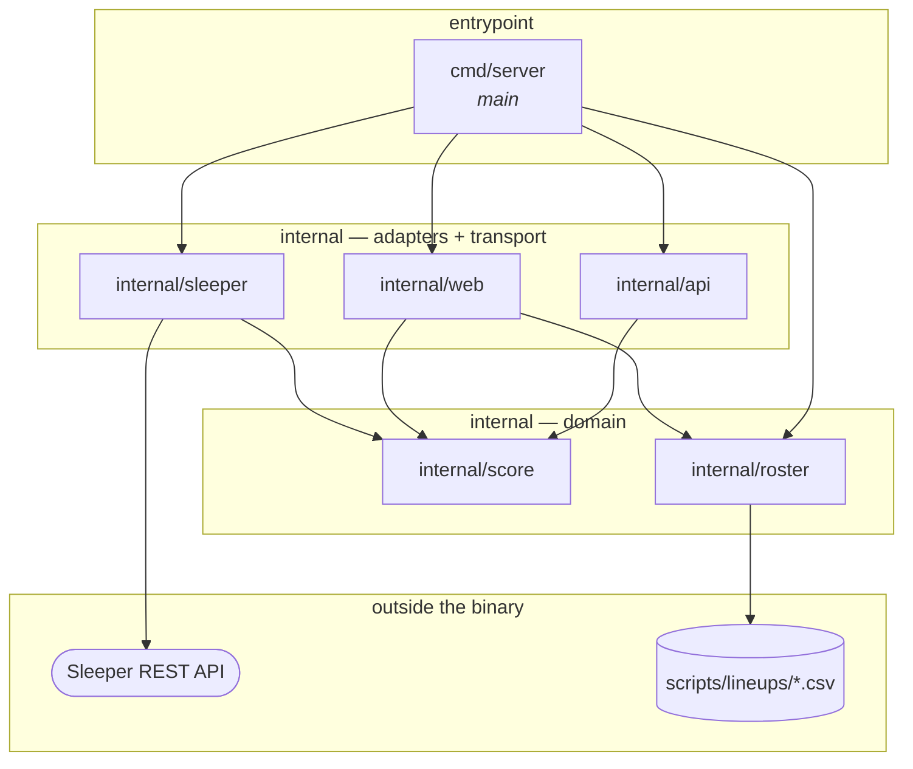

# Package Dependency Map

A one-page picture of how the Go packages relate, so a design question ("where does this belong?",
"what would that import cost me?") can be answered by looking rather than by reading code.

Scope: first-party packages only. Standard-library imports are listed per package below because
they say a lot about what a package *is* — `net/http` marks a boundary, `os` marks a reader of the
lineup tree, `html/template` marks the one package that renders.

## The map



Every arrow into the domain points inward, and nothing but `main` names a provider. That is the
shape [ADR 0002](adr/0002-live-scoreboard-backend.md) asked for, now held by the compiler rather
than by a comment.

The invariant is directional, not a count: `score` and `roster` must not import `api`, `sleeper`,
or `web`. `score` also takes no stdlib import that would commit the domain to something it should
not decide — no `net/http`, `os`, or `io` (side effects), and no `encoding/json` (a wire format).
It does import `fmt`, which commits it to nothing: a validation error naming the seasons the
league could have played is domain vocabulary, not transport.

Worth knowing that this is a weaker guarantee than it looks: `StatLine` already carries `json`
struct tags, which need no import and so cost nothing by any import metric while still encoding a
serialization decision. Read the direction of the arrows, not the length of the import lists.

## The packages

| Package | Role | Imports (first-party) | Imports (stdlib) | Imported by |
| --- | --- | --- | --- | --- |
| `cmd/server` | Process entrypoint and composition root. Constructs the provider and the lineup tree, registers routes, owns the listen address. | `internal/api`, `internal/roster`, `internal/sleeper`, `internal/web` | `log`, `net/http` | — |
| `internal/score` | The scoring domain: `StatLine`, `Points`, `WeekStats`, and the season/week bounds. | none | `fmt` | `internal/api`, `internal/sleeper`, `internal/web` |
| `internal/sleeper` | The Sleeper adapter: the HTTP client, the base URL, the stat-key transform. | `internal/score` | `context`, `encoding/json`, `fmt`, `net/http`, `time` | `cmd/server` |
| `internal/api` | The JSON transport: `POST /scores`, its DTOs, its validation. | `internal/score` | `context`, `encoding/json`, `fmt`, `log`, `net/http` | `cmd/server` |
| `internal/web` | The HTML transport: `GET /{season}/{week}`, its view model, its template. | `internal/roster`, `internal/score` | `bytes`, `context`, `embed`, `errors`, `html/template`, `log`, `net/http`, `strconv` | `cmd/server` |
| `internal/roster` | Roster/lineup knowledge: file format, tree layout, matchup resolution, starters/bench split. | none | `bufio`, `errors`, `fmt`, `io`, `os`, `path/filepath`, `strings` | `cmd/server`, `internal/web` |

### `cmd/server`
 Thin by design, and the only place the provider and the transports meet: it constructs a
`sleeper.Client` and a `roster.Tree` and hands them to `api.BatchHandler` and `web.Handler`, each of
which knows only the one-method `StatsSource` interface it declares for itself. If logic starts
appearing here, it belongs in a package instead — this file should stay readable as a table of
contents for the service.

The lineup-tree root is a constant here (`scripts/lineups`, relative to the working directory),
which is knowingly interim: it becomes an embedded filesystem when the tree moves inside a package.

Because the wiring is here, a TTL cache over the weekly fetch is additive: a caching `StatsSource`
that wraps another one, constructed in `main`, with no consumer edited.

### `internal/score`

The domain. Four files, and `fmt` is the whole of its stdlib surface:

- **`calc.go` — the rules.** `Points(StatLine) float64`.
- **`stats.go` — the vocabulary.** `StatLine`, provider-neutral. Deliberately carries no points
  field, so a stat line can never hold a stale total.
- **`weekstats.go` — the snapshot.** `WeekStats`, one season and week's stat lines keyed by player
  ID, built by an adapter through `NewWeekStats` and read through `Player`. It lives here rather
  than in the adapter so that consumers can name it without importing a provider — that is what
  makes the boundary structural rather than decorative. It is complete when returned and never
  written afterwards, so concurrent handlers can share one.
- **`bounds.go` — what may be asked about.** `ValidateSeasonWeek`. The bounds live in the domain
  because every way into the scoring path has to refuse the same nonsense: `api` validates a
  request body against them and `web` validates two URL segments. Two copies would eventually
  disagree.

### `internal/sleeper`

The only package that talks to the network, and the only one in which a Sleeper stat key appears —
a fact worth re-checking by grep rather than trusting. `FetchWeekStats` fetches once and transforms
**every** entry in the payload, so the decoded `map[string]map[string]float64` never outlives the
call. `Client` is the same thing with the base URL held in a field, so `main` wires a value.

Mapping the whole payload rather than the ~18 players a request wants is a deliberate cost, measured
rather than assumed: about 0.7 ms against the 13 ms JSON decode that produced its input. See
[ADR 0003](adr/0003-sleeper-as-initial-stat-provider.md) for why Sleeper is currently the only
provider.

### `internal/api`

The JSON edge: request validation, wire shapes, and `POST /scores`. The season and week bounds it
validates against belong to `score`; the roster-size cap is its own. It declares the
`StatsSource` interface it needs and never imports `internal/sleeper` — which is also why its
tests build a `score.WeekStats` directly instead of standing up an `httptest` server with
Sleeper JSON.

The endpoint is interim. It exists so `scripts/scores.sh` and `scripts/fantasycast.sh` run, and it
retires with them when the served page replaces them.

### `internal/roster`

Pure domain plus a file reader; no network, no HTTP. It is the Go home for what `scripts/scores.sh`
knows in bash: the `id,name` record format, the `<root>/<season>/<week>/<team>.csv` layout, and the
positional rule that the first nine records are starters.

It also answers a question no script asks: *who is playing this week*. `Tree.Matchup` lists a week
directory and returns the two team names, ours first, refusing anything that is not exactly two
rosters with `bojjaes.csv` among them. That is why the package now imports `errors` — the four
refusals are sentinel values so a caller can tell an unstaged week from a stray third file. The
rule lives here rather than in the first handler that needs it, because a week directory holding
one matchup is a fact about the tree's layout, and the layout is stated in this package and nowhere
else.

`internal/web` is its one consumer, which is what it was built for. The shell scripts keep their own
bash parsing on purpose rather than gaining a CLI shim that would be deleted later, so nothing else
imports it.

### `internal/web`

The HTML edge, and the third thing this map used to predict: it imports both domain packages so
neither has to import the other. It resolves a week to two teams through `roster.Tree`, reads both
lineups, fetches the week's stats **once**, and scores both columns from that one snapshot — the
two columns must not come from different readings of the week.

Like `internal/api` it declares its own `StatsSource` and never imports `internal/sleeper`, so its
tests build a `score.WeekStats` with `NewWeekStats` rather than standing up an `httptest` server.
That is also what makes the coming TTL cache a wrapping `StatsSource` wired in `main` with nothing
here edited.

`embed` and `html/template` are the imports that mark it: `matchup.html` lives beside the handler
and is parsed once at package initialisation, so a broken template stops the process at startup
rather than the first request. The handler renders into a `bytes.Buffer` and writes only on
success, since executing straight into the `ResponseWriter` would commit a `200` and half a page
before it could fail.

## What the shape tells you

- **`score` and `roster` still do not know about each other.** A roster is a list of player IDs;
  scoring takes player IDs. Neither needs the other's types. They meet in callers — `cmd/server`
  and `internal/web`.
- **The next edge was a third thing, as expected.** The served page arrived as `internal/web`,
  importing both, rather than `roster` importing `score` (which would drag a transport concern into
  a pure domain package) or the reverse. Expect the same of the next consumer: a season-long view
  or a lineup submitter is another package beside `web`, not a new edge between the two domains.
- **Growth pressure lands on the adapters, not the domain.** `internal/sleeper` carries the network
  dependency, `internal/api` the JSON surface, and `internal/web` the HTML one; `internal/score`
  has none of them, and a change to any of the outer three cannot reach it without an import that
  is not there.
- **Test imports add no first-party edges the map does not show.** Every test is in-package, and the
  only first-party imports any of them add are ones the package already has — no hidden test-only
  coupling, and no third-party dependencies anywhere in `go.mod`. Both `roster`'s matchup tests and
  `web`'s page tests build their fixtures in `t.TempDir()`, so the suite never reads the real
  `scripts/lineups` tree.

## Keeping this current

The edges are generated, so verify rather than remember:

```sh
# first-party edges
go list -f '{{.ImportPath}}: {{join .Imports " "}}' ./...

# including test-only imports
go list -f '{{.ImportPath}}: {{join .TestImports " "}} {{join .XTestImports " "}}' ./...
```

If the output disagrees with the map above, the map is stale.
