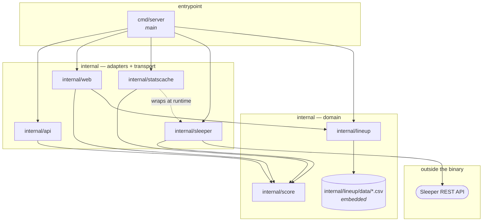

# Package Dependency Map

A one-page picture of how the Go packages relate, so a design question ("where does this belong?",
"what would that import cost me?") can be answered by looking rather than by reading code.

Scope: first-party packages only. Standard-library imports are listed per package below because
they say a lot about what a package *is* — `net/http` marks a boundary, `io/fs` and `embed` mark
the package that carries the lineup tree, `html/template` marks the one package that renders, and
`os/signal` marks the one package that owns the process's life and death.

## The map



Every arrow into the domain points inward, and nothing but `main` names a provider. That is the
shape [ADR 0002](adr/0002-live-scoreboard-backend.md) asked for, now held by the compiler rather
than by a comment.

The invariant is directional, not a count: `score` and `lineup` must not import `api`, `sleeper`,
or `web`. `score` also takes no stdlib import that would commit the domain to something it should
not decide — no `net/http`, `os`, or `io` (side effects), and no `encoding/json` (a wire format).
It does import `fmt`, which commits it to nothing: a validation error naming the seasons the
league could have played is domain vocabulary, not transport.

Worth knowing that this is a weaker guarantee than it looks: `StatLine` already carries `json`
struct tags, which need no import and so cost nothing by any import metric while still encoding a
serialization decision. Read the direction of the arrows, not the length of the import lists.

## The packages

| Package | Role | Imports (first-party) | Imports (stdlib) | Imported by |
| --- | --- | --- | --- | --- |
| `cmd/server` | Process entrypoint and composition root. Constructs the provider, wraps it in the cache, constructs the lineup tree, builds the mux, and owns the process lifecycle: listen address, connection timeouts, and the drain on `SIGTERM`. | `internal/api`, `internal/lineup`, `internal/sleeper`, `internal/statscache`, `internal/web` | `context`, `errors`, `log`, `net`, `net/http`, `os`, `os/signal`, `syscall`, `time` | — |
| `internal/score` | The scoring domain: `StatLine`, `Points`, `WeekStats`, and the season/week bounds. | none | `fmt` | `internal/api`, `internal/sleeper`, `internal/web` |
| `internal/sleeper` | The Sleeper adapter: the HTTP client, the base URL, the stat-key transform. | `internal/score` | `context`, `encoding/json`, `fmt`, `net/http`, `time` | `cmd/server` |
| `internal/statscache` | A caching decorator over a weekly stat fetch: TTL expiry, single-flight, the `TTL` constant. | `internal/score` | `context`, `log`, `sync`, `time` | `cmd/server` |
| `internal/api` | The JSON transport: `POST /scores`, its DTOs, its validation. | `internal/score` | `context`, `encoding/json`, `fmt`, `log`, `net/http` | `cmd/server` |
| `internal/web` | The HTML transport: `GET /{season}/{week}`, its view model, its template. | `internal/lineup`, `internal/score` | `bytes`, `context`, `embed`, `errors`, `html/template`, `log`, `net/http`, `strconv`, `time`, `time/tzdata` | `cmd/server` |
| `internal/lineup` | Lineup knowledge: file format, tree layout, matchup resolution, starters/bench split, and the embedded tree itself. | none | `bufio`, `embed`, `errors`, `fmt`, `io`, `io/fs`, `path`, `path/filepath`, `strings` | `cmd/server`, `internal/web` |

### `cmd/server`

Thin by design, and the only place the provider and the transports meet: it constructs a
`sleeper.Client` and a `lineup.Tree` and hands them to `api.BatchHandler` and `web.Handler`, each of
which knows only the one-method `StatsSource` interface it declares for itself — `WeekStats` for
`api`, `WeekStatsAsOf` for `web` — both satisfied by the one wrapped cache. If logic starts
appearing here, it belongs in a package instead — `main()` should stay readable as a table of
contents for the service.

The tree served is named here and only here: `main` hands `lineup.New` the embedded
`lineup.Embedded`, so no path relative to the working directory survives. Serving a
different tree — a live one off disk, say — is a different `fs.FS` at this one call site.

Because the wiring is here, the TTL cache landed as pure addition: `statscache.New` wraps the
`sleeper.Client` in this file and the wrapped value goes to both handlers, with no consumer edited
and no handler file touched. Wrapping once matters — a cache per handler would be two upstream
budgets for one league — and it is the kind of thing only a composition root can guarantee.

The package is no longer one file, and the split is what made it testable at all. `main()` is the
untested few lines that name the real environment, the real signal disposition, and the real
address; everything it calls takes those as arguments and lives beside it:

- **`addr.go`** — `resolveAddr(getenv)`. `PORT` if set and non-empty, `8080` otherwise. The lookup
  is a parameter so a test passes a map instead of mutating the process environment.
- **`mux.go`** — `newMux(stats, tree)` returns an owned `*http.ServeMux`. Registering on
  `DefaultServeMux` made the routing table process-wide state that could not be built twice in one
  test binary without a duplicate-pattern panic; as a value it can be built and driven with
  `httptest`. It also declares `statsSource`, the local composition of `api.StatsSource` and
  `web.StatsSource` that the one wrapped cache satisfies.
- **`server.go`** — `newServer(addr, h)`, the one place the four connection timeouts are set:
  read-header 5s, read 10s, write 30s, idle 60s. `http.ListenAndServe` leaves all four at zero,
  which on a 256mb machine means a handful of silent connections is the whole budget.
- **`run.go`** — `run(srv, listen, stop, grace)`. Serves in a goroutine and selects on the serve
  error and the stop channel; on stop it drains through `srv.Shutdown` under a 15s bound. Both
  `listen` and `stop` are parameters for the same reason `getenv` is: a test binds port `0` or
  hands back a bind failure, and fires the drain, without the test binary signalling itself.

The signal is the point. Fly stops a machine with `SIGTERM` — on deploy and on the idle
`auto_stop_machines` path — so a process that dies on it cuts every open response mid-body.

### `internal/score`

The domain. Four files, and `fmt` is the whole of its stdlib surface:

- **`calc.go` — the rules.** `Points(StatLine) float64`.
- **`stats.go` — the vocabulary.** `StatLine`, provider-neutral. Deliberately carries no points
  field, so a stat line can never hold a stale total.
- **`weekstats.go` — the snapshot.** `WeekStats`, one season and week's stat lines keyed by player
  ID, built by an adapter through `NewWeekStats` and read through `Player`. It lives here rather
  than in the adapter so that consumers can name it without importing a provider — that is what
  makes the boundary structural rather than decorative. It is complete when returned and never
  written afterwards, so concurrent handlers can share one.
- **`bounds.go` — what may be asked about.** `ValidateSeasonWeek`. The bounds live in the domain
  because every way into the scoring path has to refuse the same nonsense: `api` validates a
  request body against them and `web` validates two URL segments. Two copies would eventually
  disagree.

### `internal/sleeper`

The only package that talks to the network, and the only one in which a Sleeper stat key appears —
a fact worth re-checking by grep rather than trusting. `FetchWeekStats` fetches once and transforms
**every** entry in the payload, so the decoded `map[string]map[string]float64` never outlives the
call. `Client` is the same thing with the base URL held in a field, so `main` wires a value.

Mapping the whole payload rather than the ~18 players a request wants is a deliberate cost, measured
rather than assumed: about 0.7 ms against the 13 ms JSON decode that produced its input. See
[ADR 0003](adr/0003-sleeper-as-initial-stat-provider.md) for why Sleeper is currently the only
provider.

### `internal/api`

The JSON edge: request validation, wire shapes, and `POST /scores`. The season and week bounds it
validates against belong to `score`; the roster-size cap is its own. It declares the
`StatsSource` interface it needs and never imports `internal/sleeper` — which is also why its
tests build a `score.WeekStats` directly instead of standing up an `httptest` server with
Sleeper JSON.

The endpoint is interim. It exists so `scripts/scores.sh` and `scripts/fantasycast.sh` run, and it
retires with them when the served page replaces them.

### `internal/lineup`

Pure domain plus a file reader; no network, no HTTP. It is the Go home for what `scripts/scores.sh`
knows in bash: the `id,name` record format, the `<season>/<week>/<team>.csv` layout, and the
positional rule that the first nine records are starters.

It also holds the tree. `internal/lineup/data/**` is embedded with `//go:embed data` and exposed as
an `fs.FS` rooted at the season directories, so a new season is a new directory rather than an edit
to a directive. `Tree` reads through whatever `fs.FS` it is handed and never defaults to the
embedded one — naming the tree is `main`'s job ([ADR 0004](adr/0004-web-frontend-stack.md) #3).

It also answers a question no script asks: *who is playing this week*. `Tree.Matchup` lists a week
directory and returns the two team names, ours first, refusing anything that is not exactly two
lineups with `bojjaes.csv` among them. That is why the package now imports `errors` — the four
refusals are sentinel values so a caller can tell an unstaged week from a stray third file. The
rule lives here rather than in the first handler that needs it, because a week directory holding
one matchup is a fact about the tree's layout, and the layout is stated in this package and nowhere
else.

`internal/web` is its one consumer, which is what it was built for. The shell scripts keep their own
bash parsing on purpose rather than gaining a CLI shim that would be deleted later, so nothing else
imports it.

### `internal/statscache`

A decorator, not a layer: it declares the `StatsSource` interface it wraps rather than naming a
provider, and it is itself a `StatsSource` for both transports. `api` still asks for
`WeekStats(ctx, season, week) (score.WeekStats, error)`; `web` now asks for
`WeekStatsAsOf(ctx, season, week) (score.WeekStats, time.Time, error)` so a served page can date its
stats to the fetch. The cache satisfies both — `WeekStats` is a thin delegate to `WeekStatsAsOf`
that drops the instant. Installing it is `main` wrapping one value in another; removing it is
deleting that wrap.

It holds one entry per `(season, week)` — a fetch returns the whole league, so there is no partial
hit — and it does two things to bound upstream volume. The TTL caps how often a week is refetched;
single-flight collapses concurrent misses for the same week into one call, which is what a page
that refreshes itself on a timer actually needs. Neither is optional now that a browser, not a
person, decides how often the fetch happens.

Three rules are worth knowing before changing it: failures are never stored (a blip would otherwise
become a whole TTL of errors); the fetch runs on `context.WithoutCancel` under the cache's own
timeout, so the reader who happened to start it cannot cancel it out from under the others; and the
mutex is never held across the fetch, so a slow week cannot block a different one. The reasoning
is in comments at each site and in the change's notes.

`now` and `fetchTimeout` are unexported seams for tests, not configuration — `main` names neither.

### `internal/web`

The HTML edge, and the third thing this map used to predict: it imports both domain packages so
neither has to import the other. It resolves a week to two teams through `lineup.Tree`, reads both
lineups, fetches the week's stats **once**, and scores both columns from that one snapshot — the
two columns must not come from different readings of the week.

Like `internal/api` it declares its own `StatsSource` and never imports `internal/sleeper`, so its
tests build a `score.WeekStats` with `NewWeekStats` rather than standing up an `httptest` server.
That is what let the TTL cache arrive as a wrapping `StatsSource` wired in `main` with nothing here
edited.

`embed` and `html/template` are the imports that mark it: `matchup.html` lives beside the handler
and is parsed once at package initialisation, so a broken template stops the process at startup
rather than the first request. The handler renders into a `bytes.Buffer` and writes only on
success, since executing straight into the `ResponseWriter` would commit a `200` and half a page
before it could fail.

## What the shape tells you

- **`score` and `lineup` still do not know about each other.** A lineup is a list of player IDs;
  scoring takes player IDs. Neither needs the other's types. They meet in callers — `cmd/server`
  and `internal/web`.
- **The next edge was a third thing, as expected.** The served page arrived as `internal/web`,
  importing both, rather than `lineup` importing `score` (which would drag a transport concern into
  a pure domain package) or the reverse. Expect the same of the next consumer: a season-long view
  or a lineup submitter is another package beside `web`, not a new edge between the two domains.
- **Growth pressure lands on the adapters, not the domain.** `internal/sleeper` carries the network
  dependency, `internal/api` the JSON surface, and `internal/web` the HTML one; `internal/score`
  has none of them, and a change to any of the outer three cannot reach it without an import that
  is not there.
- **A few tests add first-party edges the map does not show.** Every test is in-package, and there
  are still no third-party dependencies anywhere in `go.mod`. `cmd/server` has tests now, and they
  add a test-only edge to `internal/score`: the stub that stands in for the cache has to return a
  `score.WeekStats`. But `internal/statscache`'s tests import `internal/api` and `internal/web` to assert at compile time that `*Cache` satisfies both
  transports' `StatsSource`, and `internal/web`'s tests now import `internal/statscache` to serve a
  page end to end over a real cache and check that a cache hit dates its stats to the fetch. Those
  edges are deliberate and test-only: the substitutability and the freshness attribution are the
  whole point of the decorator, so they are better checked in the packages' own tests than
  discovered in `main`. They are also where the "read the arrows" advice needs the second `go list`.
  Both `lineup`'s matchup tests and `web`'s page tests build their fixtures with `fstest.MapFS`,
  so nothing writes to disk and almost nothing reads the real tree. The exception is deliberate: one
  test in `lineup` walks every week of the embedded tree, asserting each is a matchup and that both
  lineups parse. It is a test of the data, not of the reader — with every other test on a `MapFS`,
  a malformed CSV or a week with three files would otherwise build clean and fail at request time.

## Keeping this current

The edges are generated, so verify rather than remember:

```sh
# first-party edges
go list -f '{{.ImportPath}}: {{join .Imports " "}}' ./...

# including test-only imports
go list -f '{{.ImportPath}}: {{join .TestImports " "}} {{join .XTestImports " "}}' ./...
```

If the output disagrees with the map above, the map is stale.
