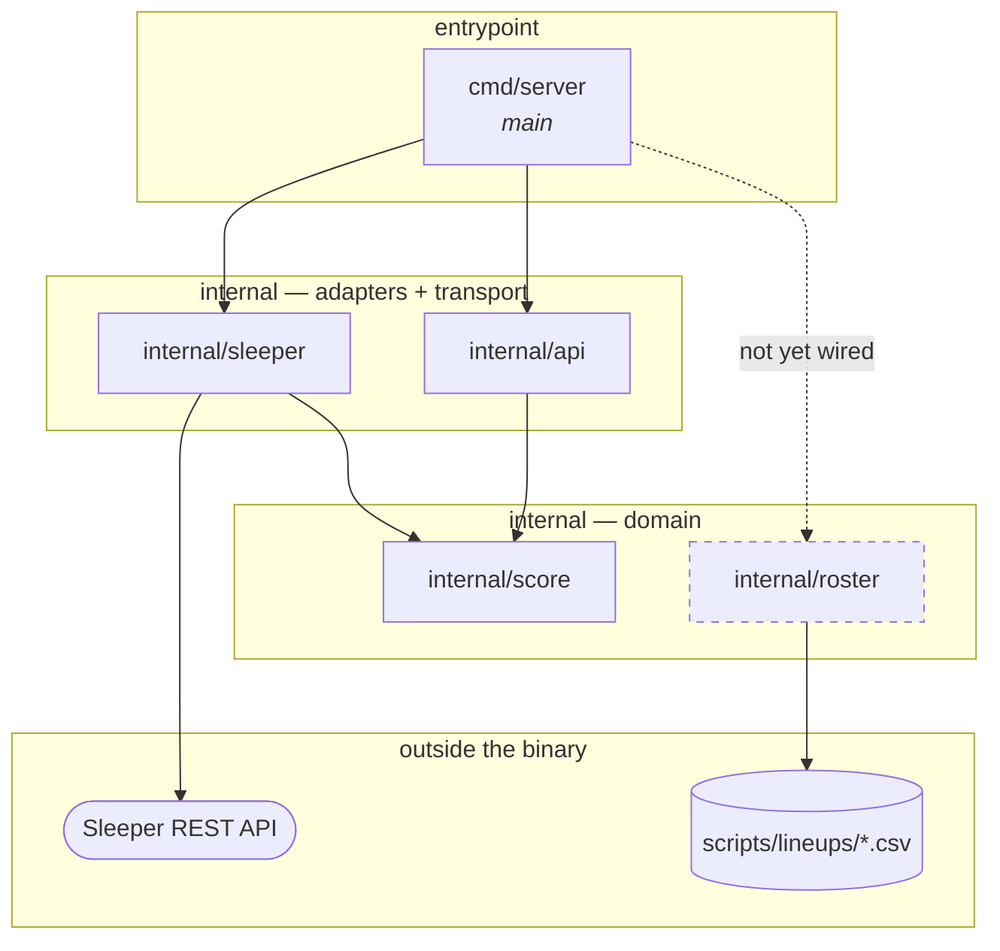

# Package Dependency Map

A one-page picture of how the Go packages relate, so a design question ("where does this belong?",
"what would that import cost me?") can be answered by looking rather than by reading code.

Scope: first-party packages only. Standard-library imports are listed per package below because
they say a lot about what a package *is* — `net/http` marks a boundary, no imports at all marks a
pure domain package.

## The map



Every arrow into the domain points inward: `score` imports nothing at all, not even from the
standard library, and nothing but `main` names a provider. That is the shape [ADR
0002](adr/0002-live-scoreboard-backend.md) asked for, now held by the compiler rather than by a
comment.

## The packages

| Package | Role | Imports (first-party) | Imports (stdlib) | Imported by |
| --- | --- | --- | --- | --- |
| `cmd/server` | Process entrypoint and composition root. Constructs the provider, registers routes, owns the listen address. | `internal/api`, `internal/sleeper` | `log`, `net/http` | — |
| `internal/score` | The scoring domain: `StatLine`, `Points`, `Week`. | none | none | `internal/api`, `internal/sleeper` |
| `internal/sleeper` | The Sleeper adapter: the HTTP client, the base URL, the stat-key transform. | `internal/score` | `context`, `encoding/json`, `fmt`, `net/http`, `time` | `cmd/server` |
| `internal/api` | The JSON transport: `POST /scores`, its DTOs, its validation. | `internal/score` | `context`, `encoding/json`, `fmt`, `log`, `net/http` | `cmd/server` |
| `internal/roster` | Roster/lineup knowledge: file format, tree layout, matchup resolution, starters/bench split. | none | `bufio`, `errors`, `fmt`, `io`, `os`, `path/filepath`, `strings` | *nothing yet* |

### `cmd/server`
 Thin by design, and the only place the provider and the transport meet: it constructs a
`sleeper.Client` and hands it to `api.BatchHandler`, which knows only the one-method `StatsSource`
interface it declares for itself. If logic starts appearing here, it belongs in a package instead —
this file should stay readable as a table of contents for the service.

Because the wiring is here, a TTL cache over the weekly fetch is additive: a caching `StatsSource`
that wraps another one, constructed in `main`, with no consumer edited.

### `internal/score`

The domain, and the only package with no imports at all — not even stdlib. Three files:

- **`calc.go` — the rules.** `Points(StatLine) float64`.
- **`stats.go` — the vocabulary.** `StatLine`, provider-neutral. Deliberately carries no points
  field, so a stat line can never hold a stale total.
- **`week.go` — the snapshot.** `Week`, one season and week's stat lines keyed by player ID, built
  by an adapter through `NewWeek` and read through `Player`. It lives here rather than in the
  adapter so that consumers can name it without importing a provider — that is what makes the
  boundary structural rather than decorative. It is complete when returned and never written
  afterwards, so concurrent handlers can share one.

### `internal/sleeper`

The only package that talks to the network, and the only one in which a Sleeper stat key appears —
a fact worth re-checking by grep rather than trusting. `FetchWeek` fetches once and transforms
**every** entry in the payload, so the decoded `map[string]map[string]float64` never outlives the
call. `Client` is the same thing with the base URL held in a field, so `main` wires a value.

Mapping the whole payload rather than the ~18 players a request wants is a deliberate cost, measured
rather than assumed: about 0.7 ms against the 13 ms JSON decode that produced its input. See
[ADR 0003](adr/0003-sleeper-as-initial-stat-provider.md) for why Sleeper is currently the only
provider.

### `internal/api`

The JSON edge: request validation, bounds, wire shapes, and `POST /scores`. It declares the
`StatsSource` interface it needs and never imports `internal/sleeper` — which is also why its
tests build a `score.WeekStats` directly instead of standing up an `httptest` server with
Sleeper JSON.

The endpoint is interim. It exists so `scripts/scores.sh` and `scripts/fantasycast.sh` run, and it
retires with them when the served page replaces them.

### `internal/roster`

Pure domain plus a file reader; no network, no HTTP. It is the Go home for what `scripts/scores.sh`
knows in bash: the `id,name` record format, the `<root>/<season>/<week>/<team>.csv` layout, and the
positional rule that the first nine records are starters.

It also answers a question no script asks: *who is playing this week*. `Tree.Matchup` lists a week
directory and returns the two team names, ours first, refusing anything that is not exactly two
rosters with `bojjaes.csv` among them. That is why the package now imports `errors` — the four
refusals are sentinel values so a caller can tell an unstaged week from a stray third file. The
rule lives here rather than in the first handler that needs it, because a week directory holding
one matchup is a fact about the tree's layout, and the layout is stated in this package and nowhere
else.

**Nothing imports it yet.** That is expected, not a gap: it was built ahead of the served
`/{season}/{week}` page from [ADR 0004](adr/0004-web-frontend-stack.md), and the shell scripts keep
their own bash parsing on purpose rather than gaining a CLI shim that would be deleted later.

## What the shape tells you

- **`score` and `roster` do not know about each other.** A roster is a list of player IDs; scoring
  takes player IDs. Neither needs the other's types. The place they meet is a caller — today
  `cmd/server`, tomorrow whatever renders the page.
- **The natural next edge is a third thing, not an edge between these two.** When the served page
  arrives, expect a handler or view package that imports both, rather than `roster` importing
  `score` (which would drag `net/http` into a pure domain package) or the reverse.
- **Growth pressure lands on the adapters, not the domain.** `internal/sleeper` carries the network
  dependency and `internal/api` the HTTP surface; `internal/score` has neither, and a change to
  either of the outer two cannot reach it without an import that is not there.
- **Test imports add no first-party edges the map does not show.** Every test is in-package, and the
  only first-party import any of them adds is `internal/score` from the two packages that already
  import it — no hidden test-only coupling, and no third-party dependencies anywhere in `go.mod`.
  `roster`'s matchup tests build their fixtures in `t.TempDir()`, so the suite never reads the real
  `scripts/lineups` tree.

## Keeping this current

The edges are generated, so verify rather than remember:

```sh
# first-party edges
go list -f '{{.ImportPath}}: {{join .Imports " "}}' ./...

# including test-only imports
go list -f '{{.ImportPath}}: {{join .TestImports " "}} {{join .XTestImports " "}}' ./...
```

If the output disagrees with the map above, the map is stale.
